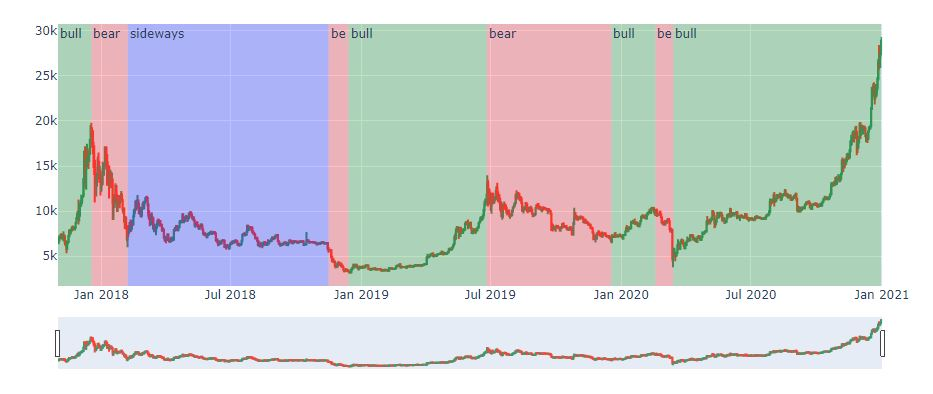

# Grafica de acciones BTC/USDT
Notebook que descarga y grafica los datos diarios de Cierre del precio de BTC/USDT en un periodo de 3 años, indicando ciclos de mercado bullish, bearish y sideways.   

